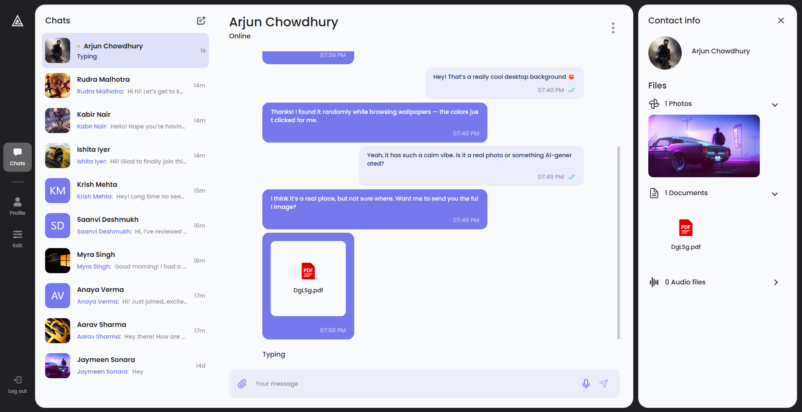

# 🗨️ Echo Chat — Real-Time Chat Application

A **full-stack real-time chat app** built with **React**, **Node.js**, and **Socket.IO**, offering smooth messaging, authentication, and a sleek, responsive interface.



---

## 🚀 Features

- 💬 **Real-time messaging** powered by Socket.IO (supports private and group chats)
- 🔐 **Secure authentication** using JWT
- 📁 **Persistent chat history** with MongoDB
- ⚙️ **Dynamic state management** via Zustand
- 🔄 **Optimized data fetching** with React Query
- 💫 **Interactive animations** using Framer Motion
- 🧠 **Form handling and validation** using React Hook Form + Yup
- 🌙 **Responsive and modern UI** built with Tailwind CSS
- 🧩 **Scalable architecture** with modular client-server design

---

## 🏗️ Tech Stack

**Frontend:** React (TypeScript), React Query, Zustand, Tailwind CSS, Framer Motion, React Hook Form, Yup
**Backend:** Node.js, Express, Socket.IO, MongoDB, Mongoose
**Auth:** JWT
**Deployment:** Vercel (client) & Render / Railway (server)
**Version Control:** Git + GitHub

---

## ⚙️ Installation & Setup

Clone repository

```bash
git clone https://github.com/Jaymeen1712/echo-chat.git
cd echo-chat
```

### 🖥️ Client Setup

```bash
cd client
npm install
npm run dev
```

### 🧩 Server Setup

```bash
cd server
npm install
npm run dev
```

Ensure you update a `.env` file in the **server** directory with the following:

```bash
DATABASE_URL=your_mongodb_connection_string
JWT_SECRET=your_secret_key
```

---

## 🌐 Live Demo

🔗 **Try it here:** [echo-chat-js.vercel.app](https://echo-chat-js.vercel.app)

---

## 🧰 Folder Structure

```
echo-chat/
├── client/               # React frontend
│   ├── src/
│   │   ├── components/
│   │   ├── hooks/
│   │   ├── store/
│   │   ├── pages/
│   │   └── utils/
│   └── package.json
├── server/               # Express + Socket.IO backend
│   ├── api/
│   │   ├── controllers/
│   │   ├── models/
│   │   ├── routes/
│   │   └── api/server.js
│   └── package.json
└── README.md
```

---

## 🧠 Key Learnings

- Efficiently managing **real-time communication** using Socket.IO
- Building a **scalable frontend architecture** with Zustand and React Query
- Ensuring **clean API integration** and consistent state sync
- Handling **form validation and authentication** securely
- Deploying and testing full-stack apps with **Vercel** and **Render**

---

## 👨‍💻 Author

**Jaymeen Sonara**
🔗 [GitHub](https://github.com/Jaymeen1712)
🔗 [LinkedIn](https://linkedin.com/in/jaymeen-sonara-101639215)
